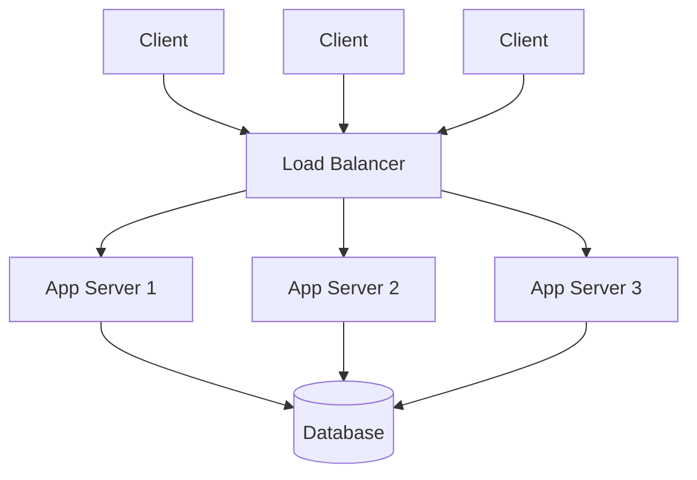

# অধ্যায় ২: স্কেলেবিলিটি, রিলায়েবিলিটি ও পারফরম্যান্সের মৌলিক স্তম্ভ

---

## ১. অধ্যায় পরিচিতি (Chapter Introduction)

প্রথম অধ্যায়ে আমরা শিখেছি — ভালো সিস্টেম শুধু "কাজ করলেই" হয় না, "কতটা ভালোভাবে কাজ করে" সেটাই আসল। সেই "কতটা ভালোভাবে"-এর পেছনে থাকে কিছু পরিমাপযোগ্য গুণ: **Scalability, Reliability, Availability, Throughput, Latency**। এগুলোই সিস্টেম ডিজাইনের শব্দভাণ্ডার (vocabulary)। একজন আর্কিটেক্ট যখন কথা বলেন, তখন এই শব্দগুলো দিয়েই তিনি সিস্টেমের স্বাস্থ্য মাপেন।

ভাবুন — একটি রেস্তোরাঁ। একজন রাঁধুনি দিনে ৫০ জন গ্রাহক সামলাতে পারেন। হঠাৎ ৫০০ জন এলে? রান্নাঘর ভেঙে পড়বে, খাবার দেরিতে আসবে, কেউ কেউ খাবার না পেয়েই ফিরে যাবে। সফটওয়্যার সিস্টেমেও ঠিক একই ঘটনা ঘটে। এই অধ্যায়ে আমরা শিখব কীভাবে একটি সিস্টেমকে আরও বেশি গ্রাহক, আরও দ্রুত এবং আরও নির্ভরযোগ্যভাবে সেবা দিতে সক্ষম করা যায় — এবং এর প্রথম হাতিয়ার **Load Balancer (লোড ব্যালেন্সার)**।

---

## ২. শেখার লক্ষ্য (Learning Objectives)

এই অধ্যায় শেষে আপনি বুঝতে পারবেন:

- **Scalability** — সিস্টেমের বৃদ্ধি সামলানোর ক্ষমতা
- **Reliability** — সিস্টেমের নির্ভরযোগ্যতা ও ব্যর্থতা সহ্য করার ক্ষমতা
- **Availability** — সিস্টেম চালু থাকার হার এবং "Nines"-এর হিসাব
- **Throughput** ও **Latency**-এর পার্থক্য ও সম্পর্ক
- **Load Balancer**-এর মৌলিক ধারণা ও কাজের পদ্ধতি
- এই গুণগুলোর মধ্যকার ট্রেড-অফ (trade-off)

---

## ৩. মূল ধারণা (Core Concepts)

### ৩.১ Scalability (স্কেলেবিলিটি)

**সংজ্ঞা:** লোড (ব্যবহারকারী, অনুরোধ, ডাটা) বাড়ার সাথে সাথে সিস্টেমের কর্মক্ষমতা বজায় রাখার ক্ষমতাই Scalability।

একটি সিস্টেম তখনই scalable, যখন আপনি সম্পদ (resource) যোগ করে এর ক্ষমতা প্রায় আনুপাতিকভাবে বাড়াতে পারেন। দুই ধরনের scaling আছে:

- **Vertical Scaling (উল্লম্ব স্কেলিং / Scale Up):** একটি সার্ভারকেই আরও শক্তিশালী করা — বেশি CPU, বেশি RAM। সহজ, কিন্তু একটি সীমা আছে এবং ব্যয়বহুল।
- **Horizontal Scaling (অনুভূমিক স্কেলিং / Scale Out):** আরও বেশি সার্ভার যোগ করা। প্রায় সীমাহীন, কিন্তু জটিল — কারণ অনুরোধ বিতরণ করতে হয়।

> এই দুটি নিয়ে অধ্যায় ৯-এ গভীরভাবে আলোচনা হবে। এখানে শুধু ভিত্তি বোঝা যথেষ্ট।

### ৩.২ Reliability (রিলায়েবিলিটি)

**সংজ্ঞা:** নির্দিষ্ট সময়ে সঠিকভাবে কাজ করার সম্ভাবনাই Reliability। একটি নির্ভরযোগ্য সিস্টেম ভুল ফলাফল দেয় না এবং ব্যর্থতার মুখেও সঠিকভাবে কাজ করে।

মূল মাপকাঠি:
- **MTBF (Mean Time Between Failures):** দুটি ব্যর্থতার মধ্যকার গড় সময়। বেশি হলে ভালো।
- **MTTR (Mean Time To Recovery):** ব্যর্থতা থেকে সেরে ওঠার গড় সময়। কম হলে ভালো।

Reliability অর্জনের মূল কৌশল: **Redundancy (অপ্রয়োজনীয়তা/বাড়তি ব্যবস্থা)** — একটি অংশ ব্যর্থ হলে আরেকটি যেন কাজ চালিয়ে নেয়।

### ৩.৩ Availability (অ্যাভেইলেবিলিটি)

**সংজ্ঞা:** মোট সময়ের কত শতাংশ সিস্টেম ব্যবহারের জন্য চালু (operational) থাকে।

```
Availability = Uptime / (Uptime + Downtime)
```

ইন্ডাস্ট্রিতে একে "Nines"-এ মাপা হয়:

| Availability | বছরে সর্বোচ্চ Downtime | পরিচিতি |
|---|---|---|
| 99% | ~৩.৬৫ দিন | "Two nines" |
| 99.9% | ~৮.৭৬ ঘণ্টা | "Three nines" |
| 99.99% | ~৫২.৬ মিনিট | "Four nines" |
| 99.999% | ~৫.২৬ মিনিট | "Five nines" |

> **গুরুত্বপূর্ণ পার্থক্য:** Reliability মানে "সঠিকভাবে কাজ করা", Availability মানে "চালু থাকা"। একটি সিস্টেম চালু (available) থাকতে পারে কিন্তু ভুল উত্তর দিতে পারে (unreliable)। উভয়ই দরকার।

### ৩.৪ Throughput vs Latency

এই দুটি প্রায়ই বিভ্রান্তি তৈরি করে। সহজ উপমা — একটি মহাসড়ক:

- **Latency (লেটেন্সি):** একটি গাড়ির এক প্রান্ত থেকে অন্য প্রান্তে পৌঁছাতে কত সময় লাগে। অর্থাৎ **একটি অনুরোধের জবাব পেতে কত সময় লাগে** (মিলিসেকেন্ডে মাপা)। কম হলে ভালো।
- **Throughput (থ্রুপুট):** প্রতি সেকেন্ডে কতগুলো গাড়ি পার হতে পারে। অর্থাৎ **প্রতি একক সময়ে কতগুলো অনুরোধ সামলানো যায়** (requests/second বা RPS)। বেশি হলে ভালো।

একটি সিস্টেমের latency কম কিন্তু throughput-ও কম হতে পারে, আবার উল্টোটাও। লক্ষ্য — **কম latency ও বেশি throughput একসাথে**।

মাপার সময় গড় (average) latency বিভ্রান্তিকর হতে পারে। তাই **percentile (পার্সেন্টাইল)** ব্যবহার করা হয়:
- **p50** — অর্ধেক ব্যবহারকারী এর চেয়ে দ্রুত সেবা পান
- **p99** — ৯৯% ব্যবহারকারী এর চেয়ে দ্রুত সেবা পান (সবচেয়ে খারাপ ১% বাদে)

বড় কোম্পানিগুলো p99 ও p99.9-এর দিকে নজর দেয়, কারণ "tail latency"-ই আসল ব্যবহারকারীর অভিজ্ঞতা নষ্ট করে।

### ৩.৫ Load Balancer (লোড ব্যালেন্সার) — মৌলিক ধারণা

**সংজ্ঞা:** Load Balancer হলো একটি কম্পোনেন্ট যা একাধিক সার্ভারের মধ্যে আগত অনুরোধ (traffic) বণ্টন করে, যাতে কোনো একটি সার্ভার অতিরিক্ত চাপে না পড়ে।

এটি horizontal scaling-এর মূল চাবিকাঠি। ক্লায়েন্ট জানেও না পেছনে কয়টি সার্ভার আছে — সে শুধু Load Balancer-এর সাথে কথা বলে।

সাধারণ বণ্টন কৌশল (algorithms):
- **Round Robin:** পালাক্রমে প্রতিটি সার্ভারে অনুরোধ পাঠানো।
- **Least Connections:** যে সার্ভারে সবচেয়ে কম সক্রিয় সংযোগ, সেখানে পাঠানো।
- **IP Hash:** ক্লায়েন্টের IP অনুযায়ী নির্দিষ্ট সার্ভারে পাঠানো (একই ব্যবহারকারী একই সার্ভার পায়)।

> Load Balancer-এর গভীর আলোচনা (Layer 4 vs Layer 7, health checks, ইত্যাদি) অধ্যায় ১০-এ হবে।

---

## ৪. বাস্তব সমস্যা (Real-World Problem Statement)

ধরুন আপনার একটি ছবি শেয়ারিং অ্যাপ আছে, একটি মাত্র সার্ভারে চলছে। প্রথম দিকে সব ঠিক। কিন্তু অ্যাপ জনপ্রিয় হলে:

- একসাথে হাজার হাজার ব্যবহারকারী এলে একটি সার্ভার সব অনুরোধ সামলাতে পারে না → **latency বেড়ে যায়**, পেজ লোড হতে ১০ সেকেন্ড লাগে।
- সার্ভারটি ক্র্যাশ করলে পুরো অ্যাপ বন্ধ → **availability শূন্য**।
- ট্রাফিক বাড়লে শুধু একটি সার্ভারকে বড় করার সীমা আছে → **scalability সমস্যা**।

সমাধান: একাধিক সার্ভার চালান এবং সামনে একটি Load Balancer বসান। এতে একসাথে scalability (বেশি সার্ভার), availability (একটি পড়লেও বাকিরা চলে), এবং কম latency (চাপ ভাগ হয়ে যায়) — তিনটিই উন্নত হয়।

---

## ৫. ভিজ্যুয়াল আর্কিটেকচার ডায়াগ্রাম (Visual Architecture Diagrams)

### Single Server (সমস্যাযুক্ত)

```
+---------+        +---------------+        +----------+
| Client  | -----> |  One Server   | -----> | Database |
+---------+        +---------------+        +----------+
                   (একমাত্র, ব্যর্থ হলেই সব বন্ধ)
```

### Load Balanced (সমাধান)



**ডায়াগ্রাম ব্যাখ্যা:**

- **Components:** একাধিক ক্লায়েন্ট, একটি Load Balancer, তিনটি App Server, একটি Database।
- **Request Flow:** সব অনুরোধ প্রথমে Load Balancer-এ আসে, যা সেগুলো তিনটি সার্ভারের মধ্যে বণ্টন করে।
- **Failure Points:** এখন একটি App Server পড়ে গেলেও Load Balancer বাকি দুটিতে অনুরোধ পাঠায় → availability বজায় থাকে। তবে লক্ষ্য করুন — Load Balancer নিজেই এখন একটি **Single Point of Failure**, এবং Database-ও একটিই। বাস্তবে এগুলোকেও redundant করতে হয় (পরবর্তী অধ্যায়গুলোতে)।
- **Scaling:** ট্রাফিক বাড়লে শুধু আরও App Server যোগ করুন — এটিই horizontal scaling।

---

## ৬. ইমপ্লিমেন্টেশন উদাহরণ (Implementation Examples)

একটি সাধারণ Load Balancer কনফিগারেশন (NGINX দিয়ে):

```nginx
# nginx.conf — তিনটি সার্ভারে Round Robin বণ্টন
upstream app_servers {
    server 10.0.0.1:3000;   # App Server 1
    server 10.0.0.2:3000;   # App Server 2
    server 10.0.0.3:3000;   # App Server 3
}

server {
    listen 80;
    location / {
        proxy_pass http://app_servers;   # অনুরোধ upstream-এ পাঠানো
    }
}
```

**ব্যাখ্যা:** `upstream` ব্লকে তিনটি ব্যাকএন্ড সার্ভার তালিকাভুক্ত। ডিফল্টভাবে NGINX এদের মধ্যে Round Robin পদ্ধতিতে অনুরোধ বণ্টন করে। ক্লায়েন্ট শুধু পোর্ট ৮০-তে আসে, পেছনের সার্ভার সম্পর্কে কিছু জানে না।

Latency বনাম Throughput বোঝার একটি ছোট সিমুলেশন (Python):

```python
import time

def handle_request():
    start = time.time()
    time.sleep(0.05)        # ৫০ মিলিসেকেন্ড প্রসেসিং
    return time.time() - start

# Latency = একটি অনুরোধের সময়
latency = handle_request()
print(f"Latency: {latency*1000:.0f} ms")   # ~50 ms

# Throughput = এক সার্ভার সেকেন্ডে কতটি সামলায় (ক্রমিকভাবে)
print(f"Throughput (১ সার্ভার): {1/latency:.0f} req/sec")  # ~20

# ৩টি সার্ভার সমান্তরালে চললে throughput প্রায় ৩ গুণ
print(f"Throughput (৩ সার্ভার): {3 * (1/latency):.0f} req/sec")  # ~60
```

**ব্যাখ্যা:** একটি সার্ভারের latency একই থাকলেও সার্ভার বাড়ালে মোট throughput বাড়ে — এটিই horizontal scaling-এর মূল সুবিধা। লক্ষ্য করুন, Load Balancer latency কমায় না (বরং সামান্য বাড়ায়), কিন্তু throughput অনেক বাড়ায়।

---

## ৭. ইন্ডাস্ট্রি কেস স্টাডি (Industry Case Studies)

- **Amazon:** গবেষণায় দেখা গেছে প্রতি ১০০ মিলিসেকেন্ড অতিরিক্ত latency-তে তাদের বিক্রি প্রায় ১% কমে। তাই তারা latency কমাতে বিপুল বিনিয়োগ করে।
- **Google:** সার্চে অতিরিক্ত ৫০০ মিলিসেকেন্ড দেরি ট্রাফিক উল্লেখযোগ্যভাবে কমিয়ে দিয়েছিল — এজন্য তারা p99 latency নিয়ে অত্যন্ত সতর্ক।
- **Netflix:** "five nines" (99.999%) availability লক্ষ্য রাখে; এজন্য তারা একাধিক ডাটা সেন্টার ও redundant সার্ভিস চালায়, এবং ইচ্ছাকৃতভাবে সার্ভার বন্ধ করে (Chaos Engineering) reliability পরীক্ষা করে।
- **WhatsApp:** অল্প সার্ভারে বিপুল throughput অর্জনের জন্য বিখ্যাত — দক্ষ আর্কিটেকচার দিয়ে কম সম্পদে বেশি কাজ।

---

## ৮. সাধারণ ভুল (Common Mistakes)

**Beginner Mistakes:**
- Throughput আর Latency গুলিয়ে ফেলা।
- Availability আর Reliability একই ভাবা।

**Intermediate Mistakes:**
- শুধু গড় (average) latency দেখা, p99 উপেক্ষা করা।
- "99% availability যথেষ্ট" ভাবা — অথচ এর মানে বছরে ৩.৬৫ দিন বন্ধ!

**Production Mistakes:**
- Load Balancer বসিয়ে সেটিকেই নতুন Single Point of Failure বানিয়ে ফেলা (redundant না করা)।
- সার্ভার বাড়ানোর সময় Database-কে ভুলে যাওয়া — যা আসল bottleneck হয়ে দাঁড়ায়।

**Scalability Mistakes:**
- শুধু vertical scaling-এর ওপর নির্ভর করা — যার একটি কঠিন সীমা আছে।

**Architecture Mistakes:**
- সার্ভারে "state" (যেমন session) রাখা, ফলে Load Balancer অনুরোধ অন্য সার্ভারে পাঠালে ব্যবহারকারী লগ-আউট হয়ে যায়। সার্ভার **stateless** রাখা উচিত।

---

## ৯. ইন্টারভিউ দৃষ্টিভঙ্গি (Interview Perspective)

**Beginner প্রশ্ন:** *Latency ও Throughput-এর পার্থক্য কী?*
> Latency = একটি অনুরোধের জবাব পেতে সময় (কম ভালো)। Throughput = প্রতি সেকেন্ডে সামলানো অনুরোধের সংখ্যা (বেশি ভালো)।

**Intermediate প্রশ্ন:** *Availability ও Reliability-এর পার্থক্য?*
> Availability = সিস্টেম চালু থাকার হার। Reliability = চালু থেকে সঠিকভাবে কাজ করার ক্ষমতা। সিস্টেম available হয়েও unreliable হতে পারে।

**Advanced প্রশ্ন:** *"Five nines" availability মানে কী এবং এটি অর্জন করা কঠিন কেন?*
> 99.999% availability — বছরে মাত্র ~৫.২৬ মিনিট downtime। এটি কঠিন কারণ প্রতিটি কম্পোনেন্ট (network, server, database, deployment) redundant ও fault-tolerant হতে হয়; একটি দুর্বল লিঙ্কই পুরো হিসাব নষ্ট করে।

**System Design প্রশ্ন:** *একটি ওয়েব সার্ভিসকে ১০০ থেকে ১০ লক্ষ ব্যবহারকারীতে নিতে প্রথম তিনটি পদক্ষেপ কী?*
> (১) একাধিক stateless App Server-এর সামনে একটি Load Balancer বসানো (horizontal scaling)। (২) Database-এ read replica যোগ করা ও caching চালু করা। (৩) p99 latency ও availability মনিটর করে bottleneck খুঁজে বের করা ও সেই অনুযায়ী scale করা।

---

## ১০. সেরা চর্চা (Best Practices)

- **App Server stateless রাখুন** — যাতে যেকোনো সার্ভার যেকোনো অনুরোধ সামলাতে পারে এবং horizontal scaling সহজ হয়।
- **p99 ও p99.9 latency মনিটর করুন**, শুধু গড় নয়।
- **Load Balancer ও Database-কেও redundant করুন** — কোনো একক Single Point of Failure যেন না থাকে।
- বাস্তবসম্মত availability লক্ষ্য নির্ধারণ করুন — প্রতিটি অতিরিক্ত "nine" খরচ বহুগুণ বাড়ায়।
- লোড টেস্টিং (load testing) করে সিস্টেমের প্রকৃত সীমা জেনে নিন, অনুমানে নয়।

---

## ১১. অধ্যায় সারসংক্ষেপ (Chapter Summary)

**মূল শেখা:**
- **Scalability** — লোড বাড়লে সম্পদ যোগ করে কর্মক্ষমতা ধরে রাখার ক্ষমতা (vertical vs horizontal)।
- **Reliability** — সঠিকভাবে কাজ করার সম্ভাবনা; মূল হাতিয়ার redundancy।
- **Availability** — চালু থাকার হার, "Nines"-এ মাপা হয়।
- **Latency** = একটি অনুরোধের সময় (কম ভালো); **Throughput** = প্রতি সেকেন্ডে অনুরোধ (বেশি ভালো)।
- **Load Balancer** — একাধিক সার্ভারে ট্রাফিক বণ্টন করে; horizontal scaling-এর ভিত্তি।
- গড় নয়, **percentile (p99)** দিয়ে পারফরম্যান্স মাপুন।

**গুরুত্বপূর্ণ পরিভাষা:** Vertical/Horizontal Scaling, MTBF, MTTR, Nines, p50/p99, Round Robin, Stateless, Single Point of Failure, Tail Latency.

---

## ১২. অনুশীলন (Practice Exercises)

**Conceptual:**
1. Availability ও Reliability-এর মধ্যে এমন একটি পরিস্থিতি বর্ণনা করুন যেখানে একটি ভালো কিন্তু অন্যটি খারাপ।
2. p50 আর p99 latency-এর মধ্যে পার্থক্য কেন গুরুত্বপূর্ণ?

**Practical:**
3. একটি সিস্টেম বছরে ৩০ মিনিট বন্ধ ছিল। এর availability শতাংশে হিসাব করুন এবং বলুন এটি কত "nines"।
4. একটি সার্ভার একটি অনুরোধ ২০ মিলিসেকেন্ডে সামলায়। ৫টি সার্ভারে আনুমানিক throughput কত হবে?

**Architecture Design:**
5. একটি নিউজ ওয়েবসাইটের জন্য Load Balancer সহ একটি high-availability আর্কিটেকচার ডায়াগ্রাম আঁকুন, যেখানে কোনো Single Point of Failure থাকবে না।

**Scenario-Based:**
6. আপনার অ্যাপের গড় latency ৫০ মিলিসেকেন্ড, কিন্তু ব্যবহারকারীরা ধীরগতির অভিযোগ করছে। সম্ভাব্য কারণ কী হতে পারে?

**Interview Challenge:**
7. ব্যাখ্যা করুন কেন শুধু সার্ভার যোগ করলেই (App layer scaling) সিস্টেম পুরোপুরি scalable হয় না — Database-এর ভূমিকা উল্লেখ করুন।

---

**অধ্যায় ২ সম্পন্ন হয়েছে।**
